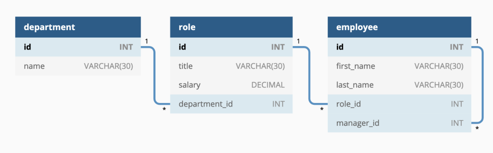
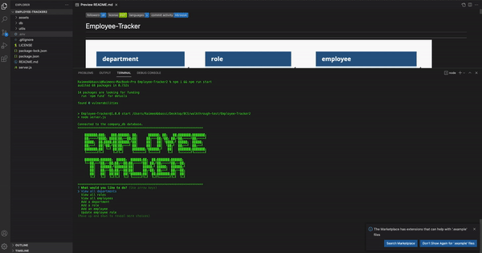
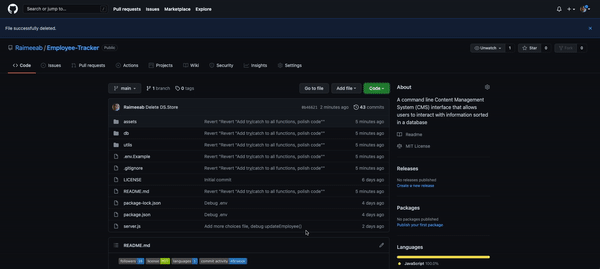
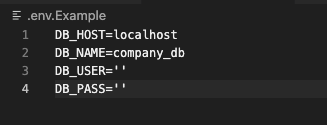
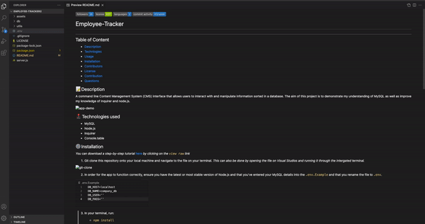

     

# Employee-Tracker
---

## Table of Content 

* [Description](#description)
* [Technlogies](#technologies)
* [Usage](#usage)
* [Installation](#installation)
* [Contributors](#contributors)
* [License](#license)
* [Contribution](#contribution)
* [Questions](#questions)

## 📝 Description
A command line Content Management System (CMS) interface that allows users to interact with and manipulate information sorted in a database. The aim of this project is to demonstrate my understanding of MySQL as well as improve my knowledge of Inquirer and node.js. I was also able to understand how relational databases operate and how to provide an intuitive way of storing and accessing structured information that improves scalability, simplicity and data accuracy. 

## 🕹 Technologies used 

- MySQL
- Node.js
- Inquirer 
- Console.table 

## ⚙️ Installation 
*You can download a step-by-step tutorial [here](https://github.com/Raimeeab/Employee-Tracker/blob/main/assets/walkthrough.mov) by clicking on the `view raw` link*

1. Git clone this repository onto your local machine and navigate to the file on your terminal. *This can also be done by opening the file on Visual Studios and running it through the intergated terminal.*

2. In order for the app to function correctly, ensure you have the latest or most stable version of Node.js and that you've entered your MySQL details into the `.env.Example` and rename the file to `.env`.

3. In your terminal, run:

    - `npm install`
    - `npm run start`

## 🖥 Usage 
This application allows you to interact with the database by: 
- viewing the departments, roles and employees in the company 
- adding departments, roles and employees in the company 
- deleteing departments, roles and employees 
- viewing employees by managers 
- viewing employees by departments 

## 👥 Contributors

*[Raimee Abbassi](https://github.com/Raimeeab)*  
*The Univserity of Sydney | Trilogy Education Services*  

## 🔖 License

MIT License
Copyright (c) [2021] [Employee-Tracker]
Permission is herby granted, free of charge, to any person obtaining a copy of this software and associated documentation files (the "Software"), to deal in the Software without restriction, including without limiation the rights to use, copy, modify, merge, publish, distribute, sublicense, and/or sell copies of the Software, and to permit persons to whom the Software is furnished to do so, subject following coditions: 
The above copyright notice and this permission notice shall be included in all copies or substantial portions of the Software. 

THE SOFTWARE IS PROVIDED "AS IS", WITHOUT WARRANTY OF ANY KIND, EXPRESS OR IMPLIED, INCLUDING BUT NOT LIMITED TO THE WARRANTIES OF MECHANTABILITY, FITNESS FOR A PARTICULAR PURPOSE AND NONINFRINGEMENT. IN NO EVENT SHALL THE AUTHORS OR COPYRIGHT HOLDERS BE LIABLE FOR ANY CLAIM, DAMAGES OR OTHER LIABILITY, WHETHER IN AN ACTION OF CONTRACT, TORT OR OTHERWISE, ARISING FROM, OUT OF OR IN CONNECTION WITH THE SOFTWARE OR THE USE OF OTHER DEALINGS IN THE SOFTWARE.  

---

## 🤝 How to Contribute

For information on how to contribute, please follow the guidlelines listed in [Contributor Covenant](https://www.contributor-covenant.org/).

## ❓ Questions
If you have any questions, contact me via [email](raimee.abbassi@gmail.com). You can also find more of my work [here](https://github.com/Raimeeab).

